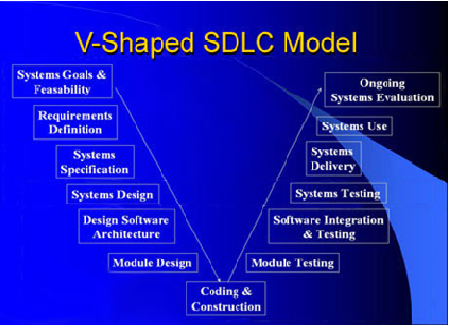
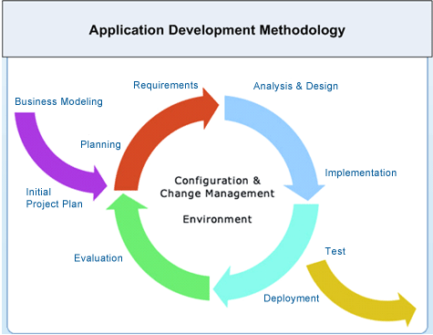
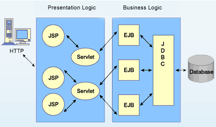
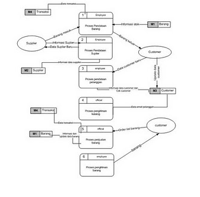
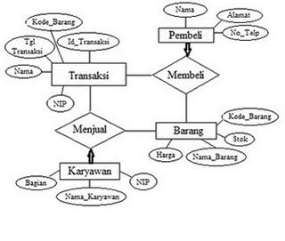
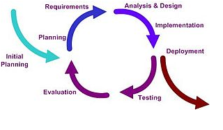

## V-Shaped SDLC Model
### Definisi
Sebuah varian dari air terjun yang menekankan verifikasi dan validasi Pengujian produk produk direncanakan secara paralel dengan fase yang sesuai perkembangan.
Proyek dan perencanaan kebutuhan - mengalokasikan sumber
Produk Persyaratan dan analisis spesifikasi - spesifikasi lengkap dari Sistem Software
Arsitektur atau hi-tingkat desain - mendefinisikan bagaimana fungsi perangkat lunak memenuhi Desain
Desain rinci - Mengembangkan algoritma untuk setiap pengembangan Operasi Produksi arsitektur, dan pemeliharaan - menyediakan perangkat tambahan dan koreksi
Sistem dan Pengujian Penerimaan - memeriksa Sistem Perangkat Lunak seluruh dalam lingkungannya.
Integrasi dan Pengujian periksa modul interkoneksi dengan benar.

### Strengths (kekuatan)
- Tekankan perencanaan untuk verifikasi dan validasi produk dalam tahap awal pengembangan produk
- Setiap penyampaian harus diuji.
- Manajemen proyek dapat melacak proyek oleh tonggak .
- Mudah digunakan.

### When To Use? (Ketika Menggunakan?)
- Pilihan yang sangat baik untuk sistem yang memerlukan keandalan yang tinggi - misalnya.
- Kontrol pasien aplikasi rumah sakitSemua persyaratan dikenal dimuka.
- Ketika dapat dimodifikasi untuk menangani perubahan lingkungan melampaui tahap analisis 
- Solusi dan teknologi yang dikenal..

## Java/J2EE Core Capabilities
Desain aplikasi, Pengembangan dan Implementasi
eFulgent menyediakan aplikasi desain kustom dan layanan pengembangan yang dilengkapi dengan manajemen proyek yang efektif. Berdasarkan praktik terbaik, kami menawarkan Software Development lengkap Lifecycle Management (SDLC). Kami juga dapat bekerja dengan in-house keahlian manajemen Anda proyek untuk beradaptasi metode SDLC kami.

Kami mengikuti pendekatan arsitektur model-driven, memanfaatkan yang terbaik dari kedua komponen komersial dan open source dan teknologi. Sumber daya teknis kami juga berpengalaman dalam penggunaan alat-alat pemodelan dan lingkungan pengembangan, termasuk Eclipse dan NetBeansT.
SOA Pemberdayaan
Kita dapat mengubah dan mengaktifkan aplikasi warisan Anda agar sesuai dengan 'Service Oriented Architecture'. Pendekatan ini memberikan kesempatan untuk mengintegrasikan aplikasi yang ada dengan aplikasi web baru serta dengan mitra bisnis Anda dan vendor.

- Java Application Development:
Didorong oleh kebutuhan bisnis, kami dapat menyediakan biaya-efektif solusi berbasis Java menggunakan paradigma yang optimal dipilih dari satu set gaya arsitektur terbukti dan opsi penyebaran. 
1.  Java Servlets, J2EE berbasis komponen desain (EJBs), JMS-untuk penyebaran menggunakan IBM WebSphere ®, JBoss dan Geronimo Apache aplikasi server .
2.  JAX Pengembangan Aplikasi menggunakan Google Web Toolkit.

## Aplikasi Enterprise Integrasi
Kita dapat mengidentifikasi dan menerapkan teknologi seperti Pesan Berorientasi Middleware (MOM) untuk mengintegrasikan aplikasi Anda dalam perusahaan maupun dengan mitra bisnis eksternal.
1.  Pengujian dan Penilaian Kinerja : eFulgent menyediakan pengujian independen dan jasa penilaian kinerja untuk membantu perusahaan Anda dalam meningkatkan kualitas dan meningkatkan kinerja.
2.  Keamanan dan Audit Kepatuhan : eFulgent menyediakan rangkaian lengkap layanan untuk aplikasi audit, proses TI dan infrastruktur TI untuk memenuhi keamanan dan peraturan yang unik untuk masing-masing sektor. Di samping persyaratan kepatuhan SOX yang biasanya berlaku untuk semua sektor, kami juga memiliki keterampilan khusus dalam Kesehatan.

## Infrastruktur Perencanaan & Pengiriman
Dalam rangka untuk memaksimalkan 'Return On Investment' (ROI) untuk IT dan untuk mengoptimalkan 'Biaya Total Kepemilikan' (TCO), eFulgent dapat bekerja dengan vendor Anda, hosting mitra dan penyedia layanan untuk merencanakan dan memberikan infrastruktur yang memenuhi beragam kinerja persyaratan aplikasi mencakup, keragaman jaringan, keamanan, skalabilitas dan redundansi. eFulgent memiliki keterampilan yang mendalam dalam terdistribusi, client server-dan infrastruktur mainframe.
- Paket Aplikasi Seleksi & Implementasi
Kemampuan inti kami telah dibuktikan melalui rekam jejak yang terbukti di berbagai sektor termasuk:
- Perbankan dan Jasa Keuangan.
- pabrik .
- perjalanan.
- kesehatan
-  ritel

## Implementasi Sistem Informasi - SDLC
System Development Life Cycle (SDLC) atau yang dikenal dengan Sistem Daur Hidup merupakan suatu bentuk yang digunakan untuk menggambarkan tahapan utama dan langkah-langkah di dalam tahapan tersebut dalam proses pengembangan sistemnya.

Metode daur hidup terdiri dari dua tahap yaitu untuk front end (bagian konsep) terdapat tahapan proses perencanaan, analisis, rancangan sistem general, evaluasi dan seleksi sedangkan di tahap back end (bagian fuingsional) terdapat tahapan proses rancangan sistem terinci, implementasi dan pemeliharaan. Di setiap tahapan proses daur hidup dilakukan proses pendokumentasian untuk laporan atas segala yang telah dilakukan atau disepakati dalam setiap tahap tersebut. Tahapan-tahapan seperti ini sebenarnya merupakan tahapan di dalam pengembangan system teknik (engineering systems). Contoh dari pengembangan engineering systems ini salah satunya adalah pengembangan konstruksi atau bangunan dari suatu gedung.

SDLC berfungsi untuk menggambarkan tahapan-tahapan utama dan langkah-langkah dari setiap tahapan yang secara garis besar terbagi dalam tiga kegiatan utama, yaitu :
1.  Analysis.
2.  Design.
3.  Implementation.

Setiap kegiatan dalam SDLC dapat dijelaskan melalui tujuan (purpose) dan hasil kegiatannya. 
Dalam tugas softskill untuk mata kuliah implementasi sistem informasi kali ini saya coba mengulas tentang sistem pengolahan data penjualan yang ada di salah satu toko pencuci cetak photo yang ada di bekasi. 
- Tahap Analysis
Dalam tahap ini saya menganalisis sistem pengolahan data penjualan pada toko ini, Apakah sudah sesuai prosedur, apakah sudah melayani kebutuhan sebuah toko , atau apakah ada system yang rusak atau error pada sistem pengolahan data penjualannya. Namun ketika melihat pada kenyataan, eror yang terjadi di karenakan kelalaian pegawai ditoko itu sendiri ketika menginput data . maka dari itu di butuhkan software yang lebih mudah penggunaannya namun mencakup semua hal yang di butuhkan untuk mengolah data penjualan pada toko tersebut.
- Tahap Design
Dalam tahap perancangan (desgin) memiliki tujuan, yaitu untuk mendesain sistem penggajian yang baru yang tidak terdapat pada sistem yang lama. Memberikan bentuk laporan sistem dan dokumennya baik input maupun output.

### Tahap Implementation 
Dalam tahap implementasi memiliki beberapa tujuan, yaitu untuk :
1.   Melakukan kegiatan spesifikasi rancangan logikal ke dalam kegiatan yang sebenarnya dari sistem informasi yang akan dibangunnya atau dikembangkannya. 
2.   Mengimplementasikan sistem yang baru. 
3.   Menjamin bahwa sistem yang baru dapat berjalan secara optimal.

Menggunakan programming fina(finance accounting) untuk mempermudah pengolahan data penjualan dan membuat laporan yang akan di kirim kepada kantor pusat setiap harinya dan hal ini berhibungan langsung dengan sistem penggajian karyawan pada tiap minngunya. Kemudian menggunakan spesifikasi computer yang mendukung untuk sistem Pengolahan data penjualan , Untuk spesifikasinya sendiri sistem pengolahan data penjualan tersebut menggunakan Pentium 4 dengan ram 1Gb dan hardisk 80GB. untuk menjaga kerahasiaan data dan admin tersebut sudah dibekali dengan skill untuk menjadi admin system tersebut. Untuk database berisi semua data tentang penjualan yang ada di toko tersebut .

### MODEL ITERASI
Merupakan model pengembangan system yang bersifat dinamis dalam artian setiap tahapan proses pengembangan system dapat diulang jika terdapat kekurangan atau kesalahan. Setiap tahapan pengembangan system dapat dikerjakan berupa ringkasan dan tidak lengkap, namun pada akhir pengembangan akan didapatkan system yang lengkap pada pengembangan system.
Model Iterasi digambarkan sebagai berikut :

Kelebihan dan Kelemahan Model Iterasi :
- Kelebihan Model Iterasi :
1.  Dapat mengakomodasi jika terjadi perubahan pada tahapan pengembangan yang telah dilaksanakan. 
2.  Dapat disesuaikan agar system bisa dipakai selama hidup software computer.
3.  Cocok untuk pengembangan sistem dan perangkat lunak skala besar.
4.  Pengembang dan pemakai dapat lebih mudah memahami dan bereaksi terhadap resiko setiap tahapan karena system terus bekerja selama proses.
- Kekurangan Model Iterasi :
1.  Hanya berlaku untuk Short-Lifetime system.
2.  Tahapan proses tidak terlihat sedang berada ditahapan mana suatu pekerjaan.
3.  Memerlukan alat ukur kemajuan secara regular.
4.  Perubahan yang sering terjadi dapat merubah struktur system.
5.  Memerlukan tenaga ahli dengan kemampuan tinggi.

### Ridwan_safarudin
